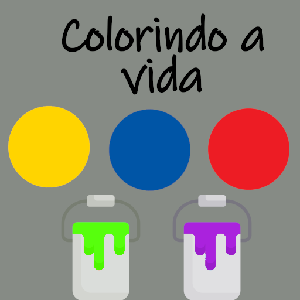

<h1 align="center">
  <br>
  PROJETO COLORINDO A VIDA ENGENHARIA DE SOTFWARE 
  <br>
  <br>
  UTFPR 2023
  <br>
  <br>
  
</h1>
<br>
<h1>Introdução</h1>
<h2>
Jogo educativo com o objetivo de ensinar as cores primária e secundárias para os alunos da ASSARTE.
</h2>


## How To Use


```bash

# Install dependencies
$ npm install

# Build the production ready code to the /dist folder
$ npm run build

# Play production ready game in the browser
$ npm run serve
```
